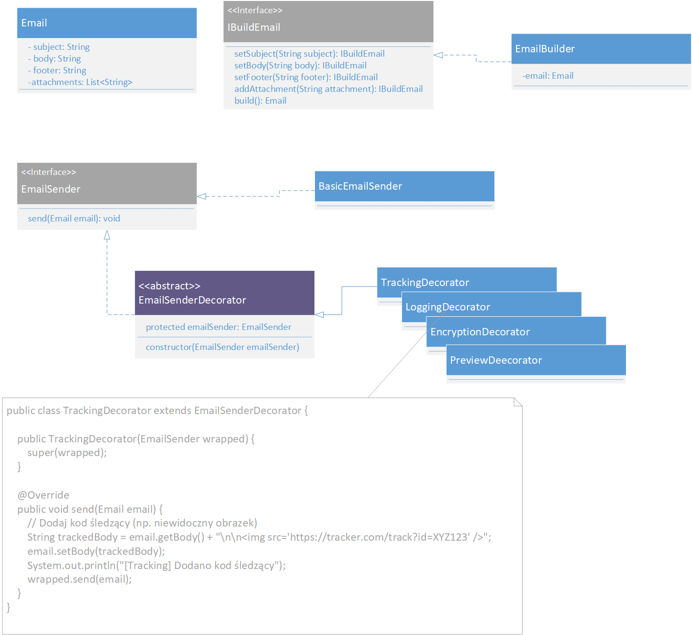

# Projekt: System wysyłki e-maili z wykorzystaniem wzorców projektowych

## 🌟 Cel projektu

Celem zadania jest stworzenie aplikacji do wysyłania wiadomości e-mail, wykorzystującej dwa wzorce projektowe:

* **Budowniczy (Builder)** – do tworzenia złożonych obiektów e-maili,
* **Dekorator (Decorator)** – do dynamicznego rozszerzania funkcji związanych z wysyłką wiadomości.

---

## 🧱 Zakres funkcjonalny

Twoja aplikacja powinna pozwalać na:

1. **Budowanie e-maili** przy pomocy klasy `EmailBuilder`, z następującymi opcjami:

   * temat wiadomości (subject),
   * treść wiadomości (body),
   * stopka (footer),
   * lista załączników (attachments).

2. **Wysyłkę e-maili** przez interfejs `EmailSender`, implementowany przez klasę bazową i dekoratory.

---

## 🧹 Wzorzec Budowniczego

Zastosuj wzorzec *Builder* do tworzenia obiektów typu `Email`. Obiekt e-maila powinien zawierać dane użytkowe:

* temat wiadomości,
* treść wiadomości,
* opcjonalną stopkę,
* listę załączników.

Zbudowany obiekt powinien być niemodyfikowalny poza klasą budującą (po zbudowaniu).

---

## 🧹 Wzorzec Dekoratora

Zaimplementuj system wysyłania wiadomości e-mail, w którym funkcje takie jak szyfrowanie, logowanie czy śledzenie mogą być **dynamicznie dodawane** przez dekoratory.

### Wymagane klasy:

* `EmailSender` – interfejs definiujący metodę `send(...)`.
* `BasicEmailSender` – podstawowa klasa wysyłająca wiadomość.
* `EmailSenderDecorator` – abstrakcyjny dekorator.

---

## 🧹 Obowiązkowe dekoratory

Poniżej opis funkcji każdego z wymaganych dekoratorów wraz z przykładowym komunikatem na konsoli:

### 🔐 `EncryptionDecorator`

Dodaje funkcję szyfrowania treści wiadomości. Treść e-maila powinna zostać zastąpiona wersją zaszyfrowaną (np. odwrócony tekst lub inne uproszczone szyfrowanie). E-mail powinien być oznaczony jako zaszyfrowany.

**Przykładowy komunikat:**

```
[Encryption] Zaszyfrowano treść wiadomości.
```

### 📜 `LoggingDecorator`

Odpowiada za logowanie informacji o wysyłanym e-mailu (np. temat, czas). Może wypisywać te dane na konsolę.

**Przykładowy komunikat:**

```
[Logging] Wysyłka wiadomości: "Temat wiadomości".
```

### 🔍 `TrackingDecorator`

Dodaje kod śledzący do treści wiadomości (np. link lub znacznik). Ten kod pozwala śledzić otwarcia lub kliknięcia. Ma być dodany na końcu treści e-maila.

**Przykładowy komunikat:**

```
[Tracking] Dodano kod śledzący do wiadomości.
```

### 🌐 `PreviewDecorator`

Generuje uproszczony podgląd HTML wiadomości (np. wyświetla temat jako nagłówek, a treść jako paragraf). Podgląd powinien być widoczny przed wysyłką.

**Przykładowy komunikat:**

```
[Preview] Generowanie podglądu HTML...
<h1>Temat wiadomości</h1>
<p>Treść wiadomości</p>
```

---

## 🧰 Dodatkowe informacje

* Nie używaj gotowych bibliotek do wysyłki e-maili – wszystko ma być symulowane przez wypisywanie danych do konsoli.
* E-mail nie musi być wysyłany przez Internet.
* Treść projektu nie powinna zawierać kopiowanego kodu z Internetu – całość implementujesz samodzielnie.

Powodzenia!




